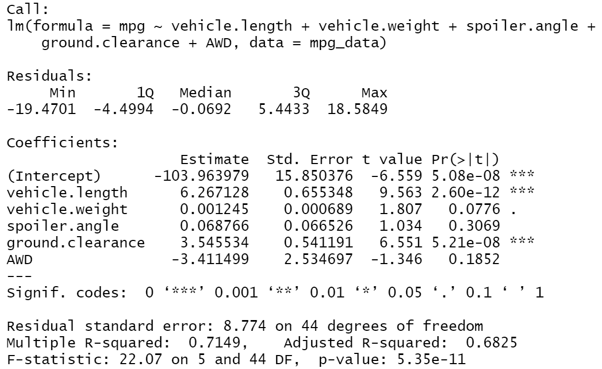
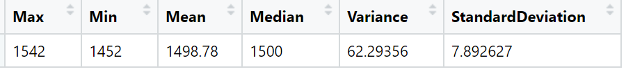
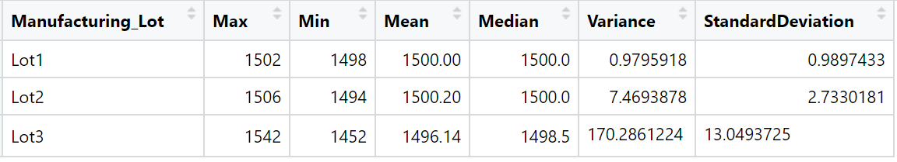
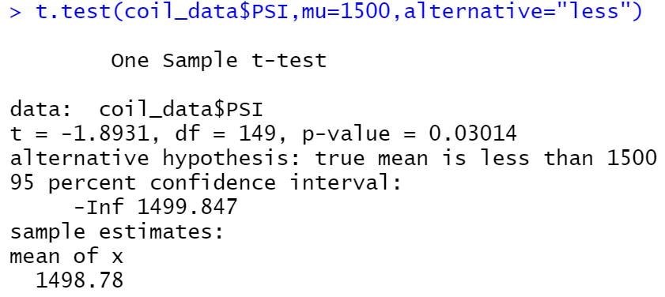

# R_Analysis
Module 15 of UofT Data Analytics Boot Camp

## Overview
To provide the technical reports based on the results of mpg testing and suspension coil testing for the MechaCar, AutosRUs’ newest prototype.

#### Objective
* Create the multiple linear regression model that represents mpg of the MechaCar and determine the factors that contribute to mpg
* Calculate basic statistics metrics and perform t-test of the weight capacity of Suspension Coils to determine that the manufacturing data meets the design specification
* Make suggestion for further development

#### Resource
* Software / Programming: R, R Studio, Jupyter Lab
* Data Source:
    1. MechaCar_mpg.csv
    2. Suspension_Coil.csv

## Results
#### MPG 
The result of statistical metrics calculated based on multiple linear regression model is as shown below.

The results indicate that;
* As coefficients of each independent variables are not zero, the slope of the linear model is not zero.
* Spoiler angle and presence of ADW are statistically unlikely to provide random amounts of variance to the linear model.
* Although the r-squared value of 0.71 indicates that model describes the current dataset well, low p-value of all individual variable suggests that the model will likely not represent the future data.

#### Suspension Coil
Two tables and a image below show the summary statistics of the capacity test of the suspension coils and the result of one sample t-test. 
The results indicate that;
* Although overall variance is lower than the design specification of less than 100, the variance of Lot3 is clearly above the design value.
* Compliance to design specification is extremely important for the car industry as the failure of the car could lead to a tragic accident and therefore strict significant level (0.001) should be applied.
* Result of t-test shows p-value of 0.03, which means that the mean of the samples are statistically different from 1500.
* Therefore the suspension coils are not meeting the design capacity and it is strongly suggested to review the manufacturing process, especially the issue that may have occured during lot 3.
* Note one sided hypothesis is used for t-test as having a suspension with higher capacity will not cause any significant issue.

Summary of all test results:

Test results by lots:

One Sample t-test:

## Further Development
#### What is the Best Way to Promote on Social Media?
* Background: Social Media is one of the tool that the potential customer would first visit to gather the latest information. It is extremely efficient tools for the customer as it does not cost money and takes no time compared to visiting dealer shops. It is important to understand how the content of the post made to social media impact the number of potential customers visiting the automaker's web page. 
* Method: I would perform the A/B test to measure the customer engagement after seeing two different type of post or advertisement on social media. It could be performed number of time to determine the most effective posts on social media. For example, the conventional post with link to the automaker's HP can be compared against the post with high quality images, videos, the specification of the vehicle and/or discount information. Null hypothesis would be there is no difference in number of customers who visit the web page after seeing the posts.
* Data: This test can be performed at low cost using the already existing company's facebook or twitter accounts for the vehicle that are already in the market. Through these tools, number of people who saw the post, who clicked on the link & etc can be gathered.

#### 